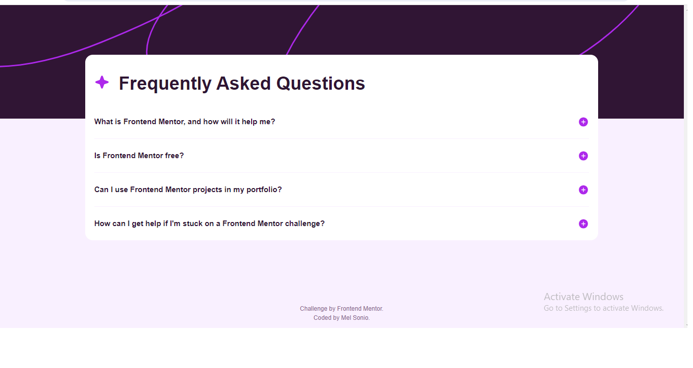

# Frontend Mentor - FAQ accordion card solution

This is a solution to the [FAQ accordion card challenge on Frontend Mentor](https://www.frontendmentor.io/challenges/faq-accordion-card-XlyjD0Oam). Frontend Mentor challenges help you improve your coding skills by building realistic projects. 

## Table of contents

- [Overview](#overview)
  - [The challenge](#the-challenge)
  - [Screenshot](#screenshot)
  - [Links](#links)
- [My process](#my-process)
  - [Built with](#built-with)
  - [What I learned](#what-i-learned)
  - [Continued development](#continued-development)
  - [Useful resources](#useful-resources)
- [Author](#author)
- [Acknowledgments](#acknowledgments)

**Note: Delete this note and update the table of contents based on what sections you keep.**

## Overview

### The challenge

Users should be able to:

- View the optimal layout for the component depending on their device's screen size
- See hover states for all interactive elements on the page
- Hide/Show the answer to a question when the question is clicked

### Screenshot



### Links

- Solution URL: [Add solution URL here](https://github.com/melgasonio/faq-accordion)
- Live Site URL: [Add live site URL here](https://melgasonio.github.io/faq-accordion/)

## My process

### Built with

- Semantic HTML5 markup
- SCSS (CSS Preprocessor) (https://sass-lang.com/)
- Flexbox
- CSS Grid
- Desktop-first workflow
- Vanilla JavaScript

### What I learned

Add ease of access for keyboard and screen-readers when images (such as icons) are used as buttons by adding button value to role attribute and value of 0 to tabindex.
```html
<div class="button-row"><span class="button-span" tabindex="0" role="button"></span></div>
```

Have separation of concerns by isolating global variables from the main style sheet.

Use modern CSS reset to stabilize some parts.

Use SASS Nesting...
```SASS Nesting
body {
    @include font('Work-Sans', $ftwtRegular);
    color: $clrPrimary300;
    background-color: $clrPrimary100;

    overflow-y: scroll;;

    p {
        line-height: $size600;
    }
}
```
and Mixins!
```SASS Mixins
// || Typography

$ftwtBold: 700;
$ftwtSemiBold: 600;
$ftwtRegular: 400;

@mixin font($fontFamily, $fontWeight) {
    font-family: $fontFamily, sans-serif;
    font-weight: $fontWeight;
}
```

Change img.src value during click events.
```js
            element.onclick = () => {
                if (answer.style.display === 'block') {
                    answer.style.display = 'none';
                    button_icon.src = "assets/images/icon-plus.svg";
                    button_icon.alt = "Click to answer answer question ${i+1}.";

                } else {
                    answer.style.display = 'block';
                    button_icon.src = "assets/images/icon-minus.svg";
                    button_icon.alt = "Click to answer close question ${i+1}.";
                }
            }
```

Making the question tabbable and enterable.
```js
    document.onkeydown = (e) => {
        if (e.key === "Enter") {
            document.activeElement.click();
        }
    };
```

### Continued development

Although I finished this project, I believe that my output is not at part to the most optimal version. Key areas that I want to learn more are:
- Better code design 
- Accessibility
- Learning libraries and frameworks
- Splitting a project into components that can be represented by git branches and commits
- Technical documentation of workflow and changes

### Useful resources

- [MDN Web Docs](https://developer.mozilla.org/en-US/docs/Web/JavaScript) - This helped me with CSS and JavaScript concepts with their docs.
- [SASS Docs](https://sass-lang.com/documentation/) - SASS has a comprehensive documentation which helped me style this project.

## Author

- Website - [Mel Sonio](https://www.your-site.com)
- Frontend Mentor - [@yourusername](https://www.frontendmentor.io/profile/melgasonio)

## Acknowledgments

I would like to thank my cats and my boyfriend for their continuous support. Without them, I would not probably finish this project.